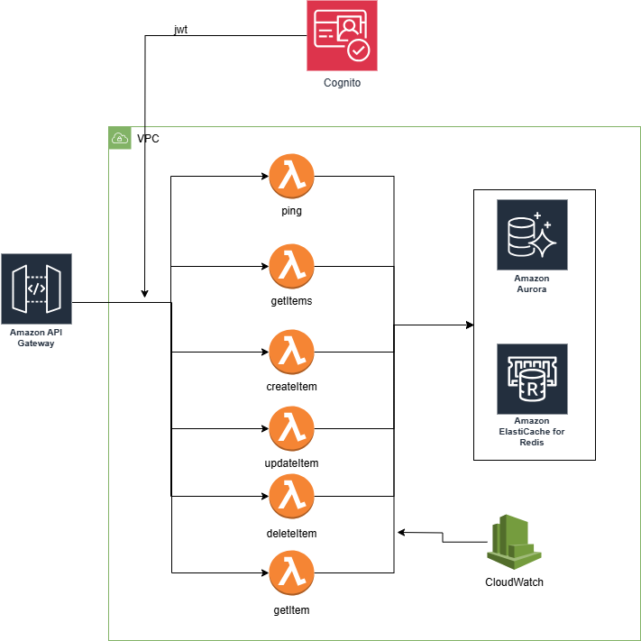

# CRUD - SERVERLESS - AWS

Este proyecto implementa un CRUD (Create, Read, Update, Delete) utilizando AWS y diversas herramientas como API Gateway, Lambda, Cognito, Aurora (MySQL) y ElastiCache (Redis). Se encuentra diseñado para ser desplegado mediante **Serverless Framework**, utilizando **TypeScript** y **Hapi.js** para un entorno local.

---

## **Diagrama de Arquitectura**
La arquitectura se representa en el siguiente diagrama:




### **Componentes Principales**

1. **API Gateway**: Exposición pública de los endpoints del CRUD. Maneja solicitudes HTTP y las redirige a funciones Lambda.

2. **AWS Lambda**: Cada operación del CRUD está implementada como una función Lambda independiente:
   - `ping`: Endpoint para health check del sistema.
   - `getItems`: Recupera una lista de items.
   - `createItem`: Crea un nuevo item.
   - `updateItem`: Actualiza un item existente.
   - `deleteItem`: Marca un item como inactivo (eliminado lógico).
   - `getItem`: Recupera un item específico por ID.

3. **Cognito**: Valida el JWT (JSON Web Token) enviado en cada solicitud para autorizar el acceso a los endpoints.

4. **Amazon Aurora (MySQL)**: Base de datos para almacenar los datos de los items. Está configurada dentro de la VPC en subredes privadas.

5. **Amazon ElastiCache (Redis)**: Sistema de caché para optimizar el acceso a datos recurrentes y reducir la carga en la base de datos.

6. **CloudWatch**: Servicio para monitorear logs y métricas de las funciones Lambda.

---

## **Local Development**

### **Scripts Disponibles**
- `dev:serverless`: Ejecuta el proyecto en modo offline con **serverless-offline**.
- `build-deploy`: Compila el proyecto y lo despliega a AWS.
- `docker:up`: Levanta los contenedores de MySQL y Redis con **docker-compose**.
- `docker:down`: Detiene y elimina los contenedores de Docker.
- `lint:cache`: Ejecuta ESLint con caché.
- `lint`: Ejecuta ESLint sin caché.
- `format`: Formatea el código con Prettier.
- `start:local`: Inicia el servidor local con **Hapi.js**.
- `test:e2e`: Ejecuta pruebas end-to-end con Jest.

### **Entorno Local**
Para ejecutar el proyecto localmente:
1. **Levantar Docker**:
   ```bash
   npm run docker:up
   ```
   Esto iniciará instancias de MySQL y Redis en contenedores.

2. **Iniciar el servidor local**:
   ```bash
   npm run start:local
   ```
   Esto levantará un servidor con Hapi.js que simula las Lambdas y el API Gateway.

3. **Probar endpoints**:
   Usa herramientas como Postman o cURL para probar los endpoints en `http://localhost:3000`.

4. **Ejecutar pruebas E2E**:
   ```bash
   npm run test:e2e
   ```

---

## **Despliegue**
El despliegue a AWS se realiza utilizando **Serverless Framework**. Ejecuta:
```bash
npm run build-deploy
```
Este comando:
1. Compila el código TypeScript.
2. Despliega las funciones Lambda y otros recursos (API Gateway, Cognito, RDS, Redis) configurados en `serverless.yml`.

## **Mejoras por Implementar**

1. **Integración de Herramientas de Monitoreo**:
   - Implementar **Prometheus** para recopilar métricas de servicios como AWS Lambda, Aurora y Redis.
   - Utilizar **Grafana** para visualizar estas métricas en tiempo real y crear dashboards personalizados.

2. **Gestión de Variables de Entorno con AWS Systems Manager (SSM)**:
   - Almacenar y gestionar las variables de entorno de manera centralizada utilizando **Parameter Store** de SSM.
   - Reemplazar variables locales en el entorno de ejecución por parámetros de SSM para mayor seguridad.

3. **Implementación de Certificados**:
   - Configurar **Amazon Certificate Manager (ACM)** para gestionar certificados SSL/TLS en el API Gateway.
   - Asegurar las comunicaciones entre el cliente y la API mediante HTTPS.

4. **Documentación Automática de Endpoints**:
   - Integrar **Swagger** o **OpenAPI** para generar documentación automática de los endpoints del CRUD.
   - Utilizar el plugin `serverless-openapi-documentation` para mantener actualizada la documentación.

### **Colección de Postman**

Para facilitar las pruebas, puedes importar la colección de Postman ubicada en:

- Descarga la colección desde aquí: [aws.postman_collection.json](./doc/aws.postman_collection.json)

1. **Importar la Colección**:
   - Abre Postman.
   - Haz clic en **Import** y selecciona el archivo `aws.postman_collection.json`.

2. **Variables de Entorno en Postman**:
   - Solicitar el Client Secret de manera interna para poder generar el token de autentificación.